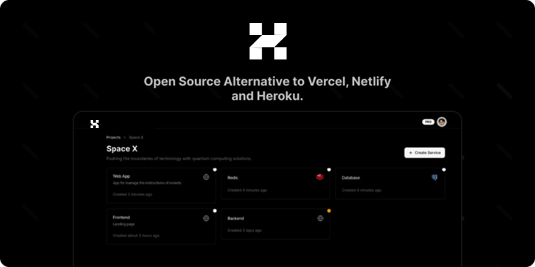

# paas — AI Assistant Context

  
   

## Platform-native CI/CD (GHA escape)

Platform owns the FULL build → deploy → test → publish lifecycle so a GitHub
Actions outage cannot halt shipping. ONE conductor (the `paas` pod), ONE build
path (an in-cluster Kaniko Job), ONE heartbeat (the build-watcher). No GHA, no
`workflow_dispatch`, no external runner registration. Contract + schema:
`docs/PLATFORM_CI.md`.

- Triggers: `app/platform/pages/api/v1/github-webhook.ts` (HMAC per
  installation) and `app/platform/pages/api/v1/arcd/enqueue.ts` (service-token,
  GitHub-free direct build). `build-callback.ts` is an optional external-builder
  completion hook (bearer token).
- Service layer: `pkg/platform/src/services/ci/` — `platform-config` (`hanzo.yml`
  parser + validator, now incl. `e2e:` + `publish:`), `github-webhook`,
  `build-job` (DB CRUD), `build-scheduler` (dispatch via `launchBuildJob`),
  `kaniko-job` (the build muscle — Kaniko Job + outcome read), `build-watcher`
  (the heartbeat: polls Kaniko Jobs, drives the pipeline), `build-completion`
  (post-build orchestrator: deploy → e2e → publish, App-free config via
  `GH_TOKEN`), `deploy-executor` (merge-patch operator `Service` CR
  `.spec.image`), `e2e-runner` (Playwright Job), `publish-job` (npm/pypi Job,
  KMS tokens).
- DB: `build_job` table (`pkg/platform/src/db/schema/build-job.ts`); migration
  `drizzle/0005_build_pipeline_columns.sql` adds `buildJobName`/`imageDigest`/
  `e2e*`/`publish*` and drops the dead `arcd_runner` table.
- tRPC: `buildJob` router (org-scoped list/one/logs/trigger).
- Build muscle: Kaniko (`gcr.io/kaniko-project/executor`) git-context
  `git://github.com/<repo>.git#<ref>` → GHCR, on `runner-pool-32g` +
  `dedicated=ci-runner`. The RETIRED long-poll/`workflow_dispatch` external-runner
  surface (build-queue, arcd-runner, `/v1/arcd/poll`+`/complete`) was removed —
  it pointed at offline GitHub runners and silently no-op'd.

## Apps inventory — the "observe" half of the control plane

`platform.hanzo.ai/apps` (the apps-lifecycle drift board, `docs/APPS_LIFECYCLE.md`)
lists every org's real apps with **declared / running / latest tag + drift +
health**. The schema (`apps`), drift logic (`apps-drift.ts`), read API
(`apps-api.ts` → `/v1/apps`), and the board UI (`pages/dashboard/apps.tsx` +
`components/dashboard/apps/apps-board.tsx`) were all already built; the table was
EMPTY because nothing populated it (the four specced cron readers were never
merged; the static `db/seed.ts` is a 16-row hardcoded bootstrap only).

The runtime populator is **`pkg/platform/src/services/apps/inventory.ts`** — one
cluster pass that unifies `read_declared_tag` + `read_running_tag`:
- lists operator `Service` CRs (`hanzo.ai/v1`, plural `services`) → `declaredTag`
  = `spec.image.tag`, `org`/`repo`/`registry` from `spec.image.repository`.
- reads the live `Deployment` of the same name → `runningTag` (the container
  whose image repo matches the CR's, so sidecars are ignored) + `health`
  (green=all ready, yellow=partial/scaled-to-0, red=desired>0 & none ready).
- `env` from namespace (`hanzo`→main, `hanzo-testnet`→test, `hanzo-devnet`→dev).
- upserts ONLY observed columns by `<org>/<app>/<env>` id; never clobbers the
  release-reader columns (`latestTag`/`releaseUrl`/`releaseAssets` — follow-up).
- resolves `organizationId` by slug/name + brand alias (hanzoai→hanzo …), else
  the lone org for single-tenant installs.

READ-MOSTLY: lists CRs + Deployments, writes only platform's own SQLite — it
NEVER mutates a cluster object, so it cannot perturb the control plane. RBAC is
already granted (`hanzo-paas-sa` ClusterRole: `hanzo.ai/services` list + `apps`
+ `pods`). Driven by `inventory-scheduler.ts` (`startInventoryScheduler`, leading
run + 60s interval, mirrors `billing-job.ts`), started from `server/server.ts`
in production (gate: `APPS_INVENTORY_DISABLED=true`). On-demand refresh:
`POST /v1/apps/sync` (service-token).

**DEPLOYED (v4.2.7, live in hanzo-k8s).** Merged via PR #45; image built
cache-busted on-cluster by the `arcbuild-platform-v427` BuildKit Job (context
`platform.git#a6831caf0`, target `platform`, `--no-cache`) → `ghcr.io/hanzoai/platform:v4.2.7`,
because ALL 324 org GitHub runners were offline (the `[self-hosted,linux,amd64]`
image jobs could not start — GHA-escape scenario; `quality` gate passed first).
The `paas` Deployment was rolled to v4.2.7 by a direct `kubectl set image`
(NOT via the operator: the operator is wedged on this Deployment — it wants
selector `{app.kubernetes.io/instance,name}` but the live Deployment's selector
is the legacy immutable `{app: paas}`, so every reconcile 422s; this also blocks
captable/console-worker/hanzo-playground). Boot verified clean (`2/2 Running`,
0 restarts); scheduler logged `synced 55 apps … hanzo-k8s=55`; `/v1/apps` → 200,
total=55 (51 hanzoai + grafana/meili/guacamole/hanzobot; envs main=51/test=2/dev=2).

**CR drift fixed:** the `paas` operator CR was reconciled from the stale
`ghcr.io/hanzoai/paas:v4.1.0` to the live `ghcr.io/hanzoai/platform:v4.2.7`
(both repo + tag were wrong — the Deployment had been image-patched out-of-band).
declared==running now.

**Release-meta reader — the third tag, now built (v4.2.8).** The drift column
was all-`red`/`no-release` because `latestTag`/`releaseUrl`/`releaseAssets` were
never populated (the `read_latest_tag`/`read_release_meta` follow-up). That
reader now exists: `pkg/platform/src/services/apps/release-reader.ts` reads each
discovered repo's latest GitHub Release (Octokit, `GH_TOKEN` already in the pod)
and bulk-writes ONLY those three columns per repo — orthogonal to `inventory.ts`
(which owns declared/running/health and deliberately omits them on upsert; the
two readers compose, neither clobbers the other). 404→`NO_RELEASE` (honest
`no-release`), non-404 re-thrown + per-repo skip so one bad repo can't stall the
pass; one GitHub call per DISTINCT repo (envs share a repo).
`inventory-scheduler.ts` now drives BOTH readers (inventory 60s; releases 10m,
`APPS_RELEASE_INTERVAL_MS`, after the first inventory pass). `/v1/apps/sync`
runs both passes (skip releases with `?releases=0`). 9 new unit tests; all 38
apps tests green; pkg typecheck clean.

This turns the board from 55 uniform `no-release` into the REAL mix the cluster
already shows: `floating-declared` (commerce `1.42.33-billing`, cloud-api
`sha-*`, chat `sha-dbed3bf`), `stale` (declared behind the latest GH release),
`zero-assets` (iam `v1.25.2` ships 0 binaries), genuine `no-release`
(console/chat/billing have NO GH release). Only 36/55 CR tags are even semver —
the rest were silently red before. Do NOT weaken `computeDrift`; it now has real
inputs to work with.

**organizationId today:** the platform DB has ONE org (`slug=admin`), so the
populator's "lone org owns everything" fallback assigns all 55 rows to it (the
`hanzoai→hanzo` alias only fires once a matching org is seeded). Per-org scoping
(`?org=`/`X-Org-Id`, the `org` column, alias resolution) is fully wired for when
more orgs exist.

Lifecycle WRITE (deploy/redeploy = patch the `Service` CR's `spec.image`) is the
CI `deploy-executor` path; the board is the observe surface only. Cross-cluster
(lux-k8s/zoo-k8s) = append `ClusterTarget`s with a KMS-loaded kubeconfig.

## Datastore — Base SQLite (tenancy)

Platform's internal datastore is Base SQLite via better-sqlite3 (`pkg/platform/src/db`).
Connection: single singleton (`index.ts`), PRAGMAs foreign_keys=ON + WAL + busy_timeout.

**Tenancy is shared-DB-with-tenant-column, NOT file-per-tenant.** 24 schema files
carry an `organizationId` column; isolation is enforced by org-scoped queries.
The CTO directive's "file is the tenant boundary" (one SQLite per org, no tenant
column) is the END-STATE, queued as a follow-up — it is NOT what ships today. The
follow-up turns the singleton into a per-org connection factory
(`dbForOrg(orgId)`); until then do not claim per-tenant-file isolation.

Deploy: persistent k8s StatefulSet + 50Gi `do-block-storage-retain` PVC at
`/app/data` (`k8s/platform-statefulset.yaml`), `PLATFORM_DB_PATH=/app/data/platform.db`,
`replicas: 1` (single SQLite writer; multi-replica needs the per-org-file design).
Secrets via KMSSecret → `platform-app-secrets` (`k8s/platform-kmssecret.yaml`).
`.do/app.yaml` is EPHEMERAL-preview-only (`PLATFORM_DB_PATH=:memory:`); App
Platform's filesystem does not survive restarts, so it must never hold a real DB.

## Auth (HIP-0111, one way) + Node-24 build
- Platform login = Hanzo IAM PKCE via **`hanzo.id`** (no Better Auth login, no genericOAuth). The settled flow + files live in `IAM_MIGRATION.md` (CANONICAL header). Don't re-add a `signIn.social`/`signIn.oauth2` button.
- Node 24 build: keep the pnpm override `nan: 2.27.0` (native deps `ssh2`/`node-pty` won't compile on Node 24 without it).

## Versioning — ONE line, `v4.x` (HIP-0111)
There is exactly one version line: **`v4.x`**. `app/platform/package.json`,
git tags, and the published `ghcr.io/hanzoai/platform` image tag are the SAME
string. Current: `v4.2.2`.

`v0.28.x` is DEAD. It was the upstream Dokploy app-string (author Mauricio Siu)
that the fork kept bumping out of habit; `v0.28.9` (#31) was the last one and is
an ancestor of `main`. Do not cut, tag, or publish `v0.28.x` again. The `v4.2.0`
/ `v4.2.1` tags were a short auth-branch snapshot taken before the
Postgres→SQLite merge (#29); their 7 auth commits (Better Auth on `/v1/auth`,
`signIn.oauth2`) are fully superseded by `main`'s IAM-PKCE flow (see Auth
section) — `main` is strictly ahead, nothing to back-merge.

Release = bump `app/platform/package.json` version, tag `main` HEAD with the
same string, let `deploy.yml` build+push the image at that tag. No second
numbering scheme, ever.

## Build resilience — runners cannot reach Docker Hub
The arcd runners resolve DNS via 8.8.8.8 and intermittently time out on
`registry-1.docker.io`; `ghcr.io` is always reachable. Two consequences, both
fixed and load-bearing — do not revert:
- `.github/buildkitd.toml` mirrors `docker.io` → `mirror.gcr.io`; every
  `docker/setup-buildx-action` in `deploy.yml` loads it via `buildkitd-config`.
- `Dockerfile` has **no `# syntax=` pragma** (it would force a Docker Hub pull of
  `docker/dockerfile:1`); the built-in buildkit frontend handles
  `RUN --mount=type=cache` on buildx ≥ v0.34.
The upstream `dokploy.yml` workflow (pushed `dokploy/dokploy` to Docker Hub,
synced `dokploy/{mcp,cli,sdk}`) was deleted — it is upstream noise, never a Hanzo
build. CI jobs that run `pnpm install` need the "Ensure native build toolchain"
step (node-gyp wants make/gcc/python for `ssh2`/`node-pty`/`bcrypt`).

## Control plane = platform.hanzo.ai (estate registration + PaaS-driven deploy)
Headless via two service-token REST surfaces (Bearer = `PAAS_SERVICE_TOKEN` /
`PLATFORM_SERVICE_TOKEN`, constant-time check in `server/v1/http.ts`). No OIDC.
Live DB = SQLite `/app/data/platform.db` (PVC `paas-app-db`, ns hanzo pod `paas-*`
container `-c paas`; only `node`+better-sqlite3, no `sqlite3` bin). Seeds persist
via the `replicate`→S3 sidecar. Org = `ah7E1dvZROQai5LTnAGsr` (admin, single-tenant,
== `DEFAULT_BUILD_ORG_ID`).
- OBSERVE — `GET /v1/apps` (apps table: declared/running/latest/drift). Reconciler
  `services/apps/inventory.ts#syncInventory` scans ONLY `DEFAULT_TARGETS=hanzo-k8s`
  operator `hanzo.ai/v1 services` CRs → 62 rows. Cross-cluster estate is registered
  by seeding `apps` rows directly (identical shape to `syncTarget`); the reconciler
  never touches non-hanzo clusters, so they persist. Registered the live web/app
  tier: +12 lux-k8s (`luxfi/lux-*` v2.0.0 + `app-lux-finance/market`), +4 zoo-k8s
  (`zoo-industries`,`zoo-bot` green; `zoo-ngo`,`zoo-zips` red/down) = 78 total.
  Greens are declaredTag==runningTag (zero version drift); ALL 78 still `drift=red`
  via the `no-release` flag — repos ship images but no semver GH Releases ("all-red
  rationale"); only per-repo CI release publishing clears it, never the control plane.
- DRIVE — `POST /v1/org/{org}/project/{proj}/env/{env}/container/{id}/redeploy`
  → `findApplicationById` → `resolveDeploymentName`(ns hanzo) → `restartWorkload`
  (rolling restart, `hanzo-paas-sa` RBAC `apps/deployments:patch` via
  `hanzo-paas-workload-manager`). Drive surface is EMPTY by default
  (application/project/environment = 0 rows) — seed the chain to register a
  container. Proof (low-risk `pricing`/`pricing.hanzo.ai`): seeded `app-pricing-001`,
  POST redeploy → `{ok:true}`, deploy gen 3→4, new RS rev4 + new pods, 45/45 health
  checks 200 (zero downtime), zero manual kubectl. This is the canonical
  PaaS-driven deploy — never `kubectl rollout restart` by hand again.

## Dedicated customer clusters — launch a customer's own "Hanzo K8S"
Platform can provision an org its OWN DOKS cluster, install the hanzo-operator +
per-tenant baseline, and make it the org's deploy target. Built on the existing
DOKS/operator primitives — NOT a parallel stack.

- SECRETS — DO token + PaaS-ticket secret come from KMS ONLY, via the one funnel
  `pkg/platform/src/services/kms.ts` (`requireKmsSecret`). Mechanism is the
  canonical KMSSecret→pod-env: both keys (`PAAS_DO_API_TOKEN`,
  `OPERATOR_PAAS_SHARED_SECRET`) are in `k8s/platform-kmssecret.yaml`.
  `doks-provisioner.ts#doHeaders` now reads the DO token through this funnel
  (was a bare `process.env`). The per-cluster KUBECONFIG is NEVER stored — it is
  derived on demand from DO (`getDoksKubeconfig`) using the KMS DO token, so the
  feature adds zero secrets to keep.
- SERVICE — `pkg/platform/src/services/dedicated-cluster.ts`. Pure (unit-tested):
  `buildClusterBaseline` (hanzo-system + tenant ns → operator bundle →
  `operator-paas-shared-secret` → ingress/gateway Service CRs, in dependency
  order), `nextPhase` (total lifecycle reducer requested→provisioning→installing
  →ready/error), `clusterTargetFromRecord` + `redactTarget`. Thin IO:
  `provisionDedicatedCluster` (KMS-gates the DO token BEFORE any paid call, then
  reuses `provisionDoksCluster`), `installClusterBaseline` (on-demand kubeconfig →
  `createK8sClients` → idempotent create-or-replace apply; marks
  operatorInstalled/baselineInstalled/phase), `selectDeployTarget` (≤1 active/org),
  `resolveOrgClusterTarget` (THE bridge → existing `ClusterTarget`; dedicated when
  active+ready+running else shared `DEFAULT_TARGETS[0]`), `migrateOrgToDedicated`.
- DB — `doks_cluster` gained `phase`/`operatorInstalled`/`baselineInstalled`/
  `active`/`baselineError` (migration `drizzle/0004_curly_human_fly.sql`, applies
  clean over 0000-0003). `phase` (platform lifecycle) is orthogonal to `status`
  (DO state): a DO-`running` cluster is not a usable target until `phase=ready`.
- SURFACE — tRPC `dedicatedCluster` router (`server/api/routers/dedicated-cluster.ts`,
  mounted in root.ts; `adminProcedure` + active-org scoped + per-cluster ownership):
  provision/installBaseline/list/get/select/migrate/target. REST mirror
  (service-token, headless): `GET|POST /v1/org/{orgId}/cluster`,
  `GET|POST /v1/org/{orgId}/cluster/select`,
  `POST /v1/org/{orgId}/cluster/{clusterId}/install-baseline`. `target`/`select`/
  `migrate` return `redactTarget` — the kubeconfig is NEVER returned.
- END-TO-END — provision (KMS DO token) → poll DO status → installBaseline (fetch
  kubeconfig on demand → apply operator+baseline) → select/migrate flips `active`
  → `resolveOrgClusterTarget(org)` now returns the dedicated `ClusterTarget`.
- TESTS — `__test__/operator/dedicated-cluster.test.ts` (20, green): baseline wire
  shape, phase reducer totality, target mapping, kubeconfig redaction, and the KMS
  gate (provision REFUSES without the KMS DO token, proven before any DO call).
- DEFERRED (cloud-embedding/CLI wave, by design): wiring `inventory.syncInventory`
  + the CI `deploy-executor` to CALL `resolveOrgClusterTarget` per-org (the single
  integration point exists; consumers still default to shared hanzo-k8s); bulk
  re-apply of an org's EXISTING CRs onto the new cluster on migrate (new deploys
  already retarget); the full operator controller bundle apply is wired
  (`applyManifestBundle` fetch+loadAllYaml+create/replace) but not exercised against
  a live cluster in CI (the pure baseline CONTRACT is what's unit-tested).
