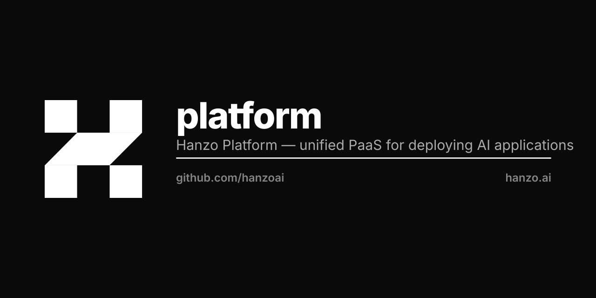

<p align="center"></p>

<div align="center">
  <a href="https://hanzo.ai">
    
  </a>
  <br />
  <br />
</div>

# Hanzo Platform

**The deploy plane of the Open AI Cloud.** A free, self-hostable Platform as a Service (PaaS) for shipping AI apps, services, and databases — one command to run, one console to manage, your infra or ours.

> Forked from [Dokploy/dokploy](https://github.com/Dokploy/dokploy) (Apache-2.0). See [NOTICE](NOTICE).

Point Platform at a repo and it builds, deploys, routes, and monitors the result — Node.js, Python, Go, Rust, static sites, containers, or full `compose.yml` stacks — with zero YAML to hand-write. Run it on a single VPS, scale it across a Docker Swarm cluster, or let it drive a dedicated Kubernetes cluster of your own.

## Features

- **Applications** — deploy any stack: Node.js, Python, Go, Rust, PHP, Ruby, static, or containers.
- **Databases** — provision and manage MySQL, PostgreSQL, MongoDB, MariaDB, libSQL, and Redis.
- **Docker Compose** — native `compose.yml` support for multi-service apps.
- **Templates** — one-click deploy of popular open-source apps.
- **Backups** — scheduled database backups to external object storage.
- **Multi-node & multi-server** — scale across a Docker Swarm cluster or deploy to remote servers.
- **Ingress & routing** — automatic TLS, routing, and load balancing.
- **Real-time monitoring** — CPU, memory, storage, and network per resource.
- **CLI & API** — manage everything from the command line or the `/v1` REST API.
- **Notifications** — deploy success/failure via Slack, Discord, Telegram, Email, and more.
- **Self-hosted** — own the whole plane; run it anywhere Docker runs.

## Getting started

Provision on any VPS with a single command:

```bash
curl -sSL https://hanzo.ai/install.sh | sh
```

Prefer managed? Skip setup with [Hanzo Cloud](https://app.hanzo.ai).

## Develop locally

This is a pnpm monorepo (Node per [`.nvmrc`](.nvmrc), pnpm ≥ 10).

```bash
pnpm install            # install workspace deps
pnpm platform:setup     # one-time local setup
pnpm platform:dev       # run the app with hot reload
pnpm build              # production build (all packages)
pnpm test               # run the test suite
```

Workspace layout: `app/*` (Next.js app + schedulers), `pkg/platform` (the server + services), `pkg/mcp`, `pkg/zap`. The OpenAPI surface lives in [`openapi.json`](openapi.json); regenerate it with `pnpm generate:openapi`.

## Documentation

Full docs at [docs.hanzo.ai](https://docs.hanzo.ai). In-repo design notes live under [`docs/`](docs) — including the platform-native CI/CD contract ([`docs/PLATFORM_CI.md`](docs/PLATFORM_CI.md)) and the apps-lifecycle drift board ([`docs/APPS_LIFECYCLE.md`](docs/APPS_LIFECYCLE.md)).

## Contributing

See the [Contributing Guide](CONTRIBUTING.md).

## Hanzo — the Open AI Cloud

Open source · every language · on-chain settlement. [hanzo.ai](https://hanzo.ai) · [docs.hanzo.ai](https://docs.hanzo.ai)

**SDKs in every language** — [Python](https://github.com/hanzoai/python-sdk) (flagship) · [TypeScript](https://github.com/hanzo-js/sdk) · [Go](https://github.com/hanzo-go/sdk) · [Rust](https://github.com/hanzo-rs/sdk) · [C++](https://github.com/hanzo-cpp/sdk) · [Swift](https://github.com/hanzo-swift/sdk) · [Kotlin](https://github.com/hanzo-kt/sdk) · [umbrella](https://github.com/hanzoai/sdk)
